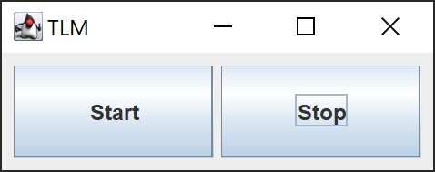

# DI-client
## Describe
Приложение написанно для задач:
- прием UDP пакетов на указанном порту
- парсинг принятых байты в заранее известный формат данных
- проверка достоверности принятого пакета по заранее известному алгоритму (соотвествие последовательности номеров пакетов, и контрольной суммы)
- отображение принятых пакетов

## Install
Чтобы запустить приложение, запустить класс Main в пакете client-App  
Выбрать порт и нажать Start  
  
**Тестовое приложение**  
Для проверки на тестовых данных используется приложение TLMServer в пакете vniiem  
При нажатии кнопки Start начнут отправляться данные на *localhost:15000*  
  

## Libraries
Используется:
- javaFx: 19